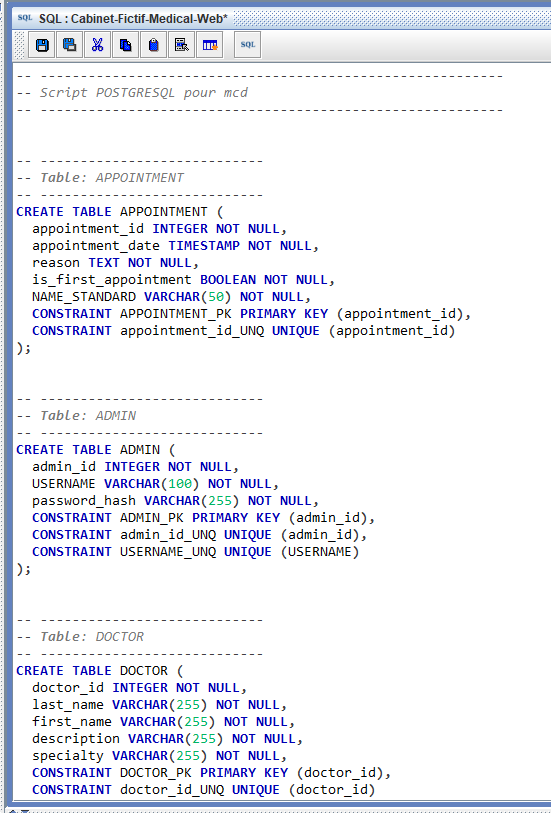

# Cabinet Médical Fictif 🏥

Un projet démontrant des compétences en développement **PHP**, **PostgreSQL** et **Docker**.

---

127.0.0.1cabinet_medical## 🎯 Guide du Recruteur / Reviewer Guide

Ce projet a été conçu pour répondre à **12 critères fonctionnels** précis (6 minimaux, 6 optionnels).  
Voici comment tester chacun d'eux étape par étape.

---

### 🚀 Installation Rapide (Quick Start)

**Prérequis :** Docker Desktop installé.

```powershell
# À la racine du projet
docker-compose down -v     # (Optionnel)
docker-compose up --build -d
```

**Accès :**
| Service | URL |
|---------|-----|
| 🌐 **Site Web** | [http://localhost](http://localhost) |
| 📧 **MailHog** (Emails) | [http://localhost:8025](http://localhost:8025) |

---

### ✅ Fonctionnalités Minimales (6/6)

| # | Fonctionnalité | Comment Tester |
|---|----------------|----------------|
| **M1** | **Inscription Patient** | 1. Cliquez **Inscription**<br>2. Remplissez le formulaire (email, login, mdp x2, tél)<br>3. Vérifiez le message de succès |
| **M2** | **Authentification** | 1. Allez sur **MailHog** (`localhost:8025`)<br>2. Cliquez sur le lien de vérification<br>3. Connectez-vous sur `/login` |
| **M3** | **Prise de RDV** | 1. Connecté en patient → **Prendre RDV**<br>2. Choisissez médecin, date, heure, motif<br>3. Validez |
| **M4** | **Annulation RDV** | 1. Allez dans **Tableau de Bord**<br>2. Cliquez **Annuler** à côté d'un RDV |
| **M5** | **Multi-RDV** | Prenez plusieurs RDV (différents médecins/dates) et vérifiez qu'ils apparaissent tous |
| **M6** | **Créneaux Libres** | 1. Page **Médecins** → **Voir Disponibilités**<br>2. Le calendrier affiche créneaux verts (libres) / rouges (occupés) |

---

### ✨ Fonctionnalités Optionnelles (6/6)

| # | Fonctionnalité | Comment Tester |
|---|----------------|----------------|
| **O1** | **Email Vérification** | À l'inscription, un email est envoyé → visible sur **MailHog** (`localhost:8025`) |
| **O2** | **PDF Récapitulatif** | Après réservation, cliquez **Télécharger PDF** pour obtenir le récapitulatif |
| **O3** | **AJAX / Ergonomie** | Sur la page Disponibilités, changez de semaine → le calendrier se met à jour **sans recharger** |
| **O4** | **Admin: Gérer Docs** | 1. Login: `admin` / `admin123`<br>2. Menu: **Gérer Médecins**<br>3. Ajoutez/Supprimez un médecin |
| **O5** | **Admin: Planning** | En tant qu'Admin, le Tableau de Bord affiche le planning de **tous** les médecins |
| **O6** | **Pages Présentation** | Naviguez sur **Accueil** et **Le Cabinet** pour voir le design responsive |

---

### 📐 Conception & Modélisation

Voici les diagrammes de conception qui ont servi de base au développement de l'application.

#### 1. Diagramme de Cas d'Utilisation (Use Case)


#### 2. Modèle Conceptuel de Données (MCD)


#### 3. Modèle Logique de Données (MLD)


#### 4. Maquette Initiale


---

### 🔑 Identifiants de Démonstration

| Rôle | Utilisateur | Mot de passe |
|------|-------------|--------------|
| **Administrateur** | `admin` | `admin123` |
| **Docteur** | `dr.dubois` | `doctor1` |
| **Docteur** | `dr.martin` | `doctor2` |
| **Patient** | *(À créer via Inscription)* | - |

---

### 🛠️ Stack Technique

| Catégorie | Technologies |
|-----------|--------------|
| **Backend** | PHP 8.2 (Vanilla, PDO), PostgreSQL 15 |
| **Frontend** | HTML5, W3.CSS v5, JavaScript (AJAX) |
| **DevOps** | Docker, Docker Compose |
| **Sécurité** | `password_hash()`, requêtes préparées (SQLi protection) |
| **Email** | MailHog (SMTP local pour tests) |

---
