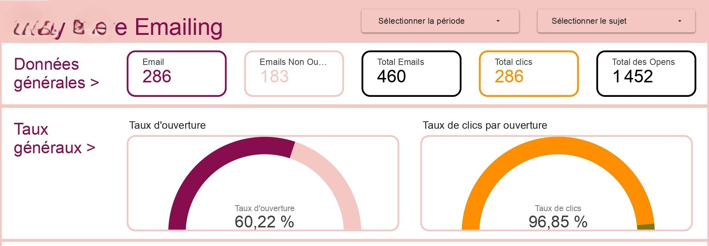
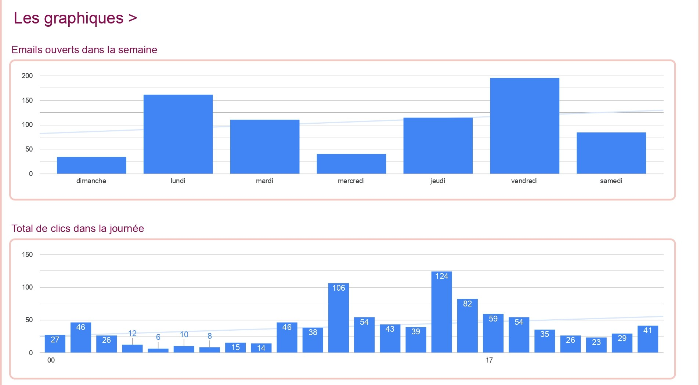
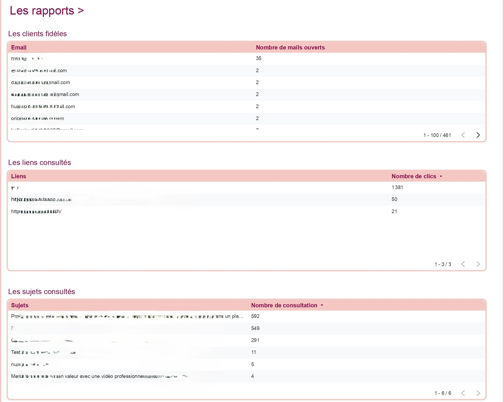
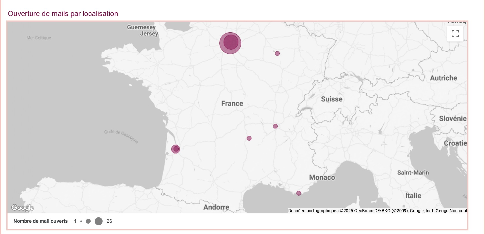
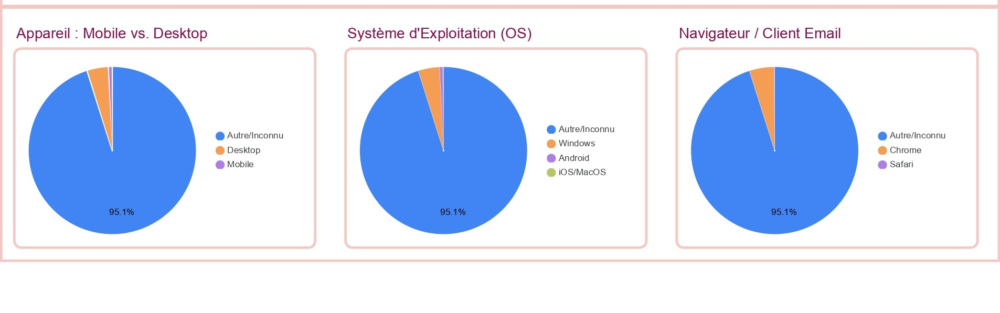
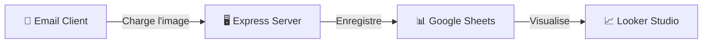

## Vos Statistiques d'Emailing en un coup d'œil avec Looker Studio

Le tableau de bord Looker Studio garantit un accès clair à des statistiques rapides de campagne d'Emailing, permettant ainsi d'optimiser et de rendre plus efficaces les futures stratégies d'envoi.

### 1. KPIs Généraux
| Métrique | Description |
|----------|-------------|
| **Total Emails** | Nombre total d'emails envoyés |
| **Emails Ouverts** | Nombre d'emails effectivement ouverts |
| **Taux d'Ouverture** | Pourcentage d'ouverture par rapport aux envois |

### 2. Analyse Temporelle
- **Emails ouverts dans la semaine** : Distribution des ouvertures par jour
- **Total de clics dans la journée** : Ouvertures par heure

### 3. Rapports Détaillés
- **Clients fidèles** : Top des clients les plus actifs
- **Liens consultés** : Liens les plus cliqués dans les emails

### 4. Analyse Géographique
Carte interactive des ouvertures par région/pays.

### 5. Analyse Technique
| Dimension | Informations collectées |
|-----------|------------------------|
| **Appareil** | Mobile, Desktop, Tablette |
| **Navigateur** | Client email ou navigateur utilisé |

---

# 📧 Email Tracker - Pixel de Suivi Sécurisé

> Un micro-service conteneurisé pour tracker les ouvertures d'emails via un pixel invisible 1x1, avec visualisation en temps réel sur Looker Studio.

### 🚀 **[Voir les données en temps réel sur Google Sheets](https://docs.google.com/spreadsheets/d/1nrTaYbgPlQ6pkQJciesmsbNWtLIxSX1mYTfJ8tflIUY/edit?usp=sharing)** | **[📊 Voir le Dashboard Looker Studio](https://lookerstudio.google.com/reporting/d4218795-26ec-4770-bd6d-1634ff8426f5)**

> **👨‍💻 Testez-le vous-même !**
> 1. Ouvrez l'application live (lien hébergé sur Render).
> 2. Entrez votre adresse email dans le champ prévu.
> 3. Allez sur votre boîte mail et cliquez sur/ouvrez le mail reçu.
> 4. **Observez l'ajout d'une nouvelle ligne en temps réel** sur le lien Google Sheet ci-dessus.

---

## 🏗️ Architecture du Système

### Flux de Données
1. **Génération** : Un identifiant de suivi unique est généré pour chaque email
2. **Intégration** : Une balise `` est insérée dans le HTML de l'email
3. **Ouverture** : Le client email charge l'image depuis notre endpoint
4. **Enregistrement** : Le serveur ajoute une ligne dans Google Sheets (ID, Horodatage, IP, User Agent)
5. **Réponse** : Un pixel transparent 1x1 est renvoyé (invisible pour l'utilisateur)

---

## 🛠️ Stack Technique

| Composant | Technologie |
|-----------|-------------|
| **Backend** | Node.js v18 (Express.js) et Render |
| **Base de Données** | Google Sheets (via API) |
| **Infrastructure** | Docker & Docker Compose |
| **Sécurité** | Service Account Google Cloud |

---

## 💡 Compétences Démontrées

- ✅ Développement d'API REST avec **Node.js/Express**
- ✅ Intégration d'APIs tierces (**Google Sheets API**)
- ✅ Conteneurisation avec **Docker**
- ✅ Sécurisation via **Service Account**
- ✅ Analyse de données et visualisation (**Looker Studio**)
- ✅ Conception de systèmes de tracking respectueux de la vie privée

---

## 📄 Licence

MIT © 2024
