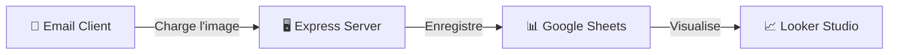

# 📧 Email Tracker - Pixel de Suivi Sécurisé


> Un micro-service conteneurisé pour tracker les ouvertures d'emails via un pixel invisible 1x1, avec visualisation en temps réel sur Looker Studio.

---

## Vos Statistiques d'Emailing en un coup d'œil avec Looker Studio

Le tableau de bord Looker Studio garantit un accès clair à des statistiques rapides de campagne d'Emailing, permettant ainsi d'optimiser et de rendre plus efficaces les futures stratégies d'envoi.

### 1. KPIs Généraux
| Métrique | Description |
|----------|-------------|
| **Total Emails** | Nombre total d'emails envoyés |
| **Emails Ouverts** | Nombre d'emails effectivement ouverts |
| **Taux d'Ouverture** | Pourcentage d'ouverture par rapport aux envois |


### 2. Analyse Temporelle
- **Emails ouverts dans la semaine** : Distribution des ouvertures par jour
- **Total de clics dans la journée** : Ouvertures par heure


### 3. Rapports Détaillés
- **Clients fidèles** : Top des clients les plus actifs
- **Liens consultés** : Liens les plus cliqués dans les emails


### 4. Analyse Géographique
Carte interactive des ouvertures par région/pays.


### 5. Analyse Technique
| Dimension | Informations collectées |
|-----------|------------------------|
| **Appareil** | Mobile, Desktop, Tablette |
| **Navigateur** | Client email ou navigateur utilisé |


---

## 🏗️ Architecture du Système



### Flux de Données
1. **Génération** : Un identifiant de suivi unique est généré pour chaque email
2. **Intégration** : Une balise `` est insérée dans le HTML de l'email
3. **Ouverture** : Le client email charge l'image depuis notre endpoint
4. **Enregistrement** : Le serveur ajoute une ligne dans Google Sheets (ID, Horodatage, IP, User Agent)
5. **Réponse** : Un pixel transparent 1x1 est renvoyé (invisible pour l'utilisateur)

---

## 🛠️ Stack Technique

| Composant | Technologie |
|-----------|-------------|
| **Backend** | Node.js v18 (Express.js) |
| **Base de Données** | Google Sheets (via API) |
| **Infrastructure** | Docker & Docker Compose |
| **Sécurité** | Service Account Google Cloud |

---

## 💡 Compétences Démontrées

- ✅ Développement d'API REST avec **Node.js/Express**
- ✅ Intégration d'APIs tierces (**Google Sheets API**)
- ✅ Conteneurisation avec **Docker**
- ✅ Sécurisation via **Service Account**
- ✅ Analyse de données et visualisation (**Looker Studio**)
- ✅ Conception de systèmes de tracking respectueux de la vie privée

---

## 🚀 Démarrage Rapide

### Prérequis
- Docker & Docker Compose
- Compte de Service Google Cloud :
  1. Créez un projet sur [Google Cloud Console](https://console.cloud.google.com/)
  2. Activez l'API **Google Sheets API**
  3. Créez un Service Account et téléchargez la clé JSON → `credentials.json`
  4. Créez un Google Sheet et partagez-le avec l'email du Service Account (droits éditeur)

### Installation

```bash
# 1. Cloner le repository
git clone https://github.com/votre-username/email-tracker.git
cd email-tracker

# 2. Configurer les variables d'environnement (Optionnel en local)
# Pour une utilisation locale avec Docker, aucune configuration n'est requise (MailHog capture les emails).
# Pour utiliser Google Sheets, ajoutez credentials.json à la racine.

# 3. Démarrer le service
docker-compose up -d --build
```

L'application sera accessible sur `http://localhost:3000`

### Utilisation

1.  **Interface de Démo** : Allez sur `http://localhost:3000`.
2.  **Test d'Envoi** : Entrez une adresse email (réelle ou fictive) et cliquez sur "Envoyer".
3.  **Vérification (Local)** : Ouvrez **MailHog** sur `http://localhost:8026` pour voir l'email envoyé.
4.  **Tracking** : Ouvrez l'email dans MailHog. Le pixel sera chargé.
5.  **Analytics** : Si vous avez connecté Google Sheets, une nouvelle ligne apparaîtra. [Voir les résultats en direct](https://docs.google.com/spreadsheets/d/1nrTaYbgPlQ6pkQJciesmsbNWtLIxSX1mYTfJ8tflIUY/edit?usp=sharing)

### Générer un Lien Manuellement

```bash
# Via Docker
docker exec -it email-tracker-app npm run generate

# Ou localement
node src/utils/generate_link.js
```

### Visualiser les Données
Ouvrez votre Google Sheet — chaque ouverture d'email ajoutera automatiquement une ligne avec les détails de l'événement.

---

## 📄 Licence

MIT © 2024
