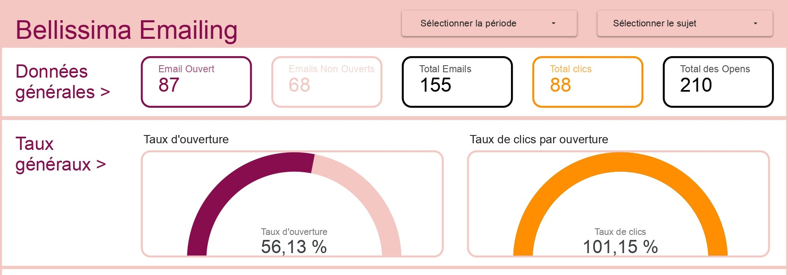
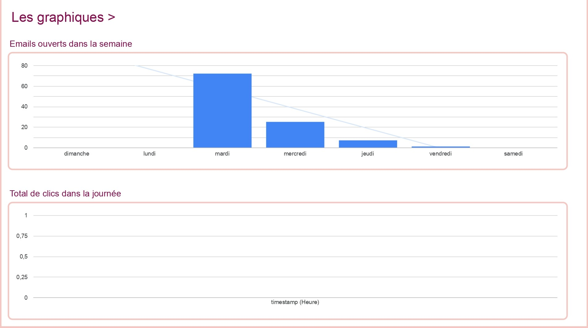
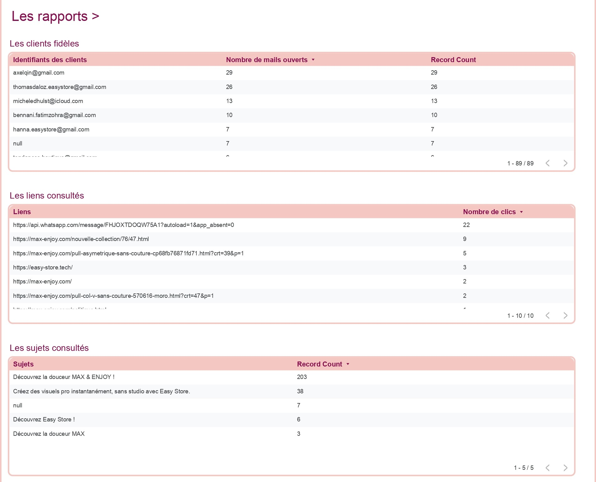
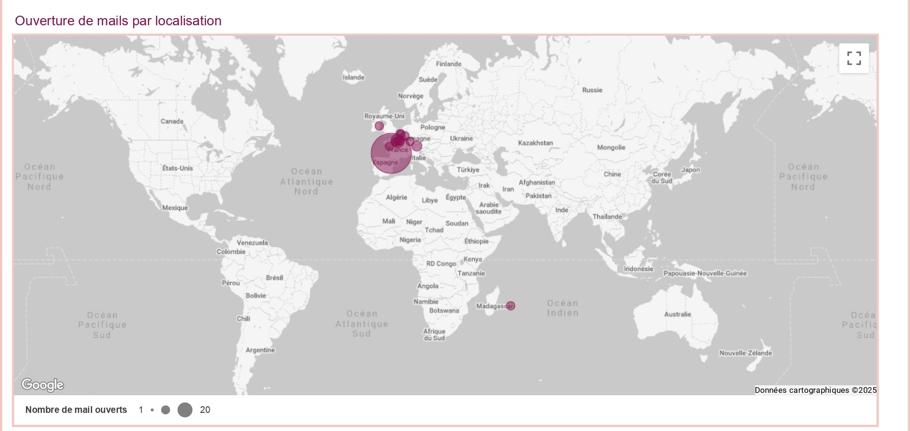

# Email Interaction Tracker

A secure, minimal, and dockerized service for tracking email interactions via a 1x1 pixel. Built with **Node.js (Express)** and **PostgreSQL**, designed for easy integration with Business Intelligence tools like Looker Studio.

## Stack
- **Backend:** Node.js v18 (Express.js)
- **Database:** PostgreSQL 15
- **Infrastructure:** Docker & Docker Compose
- **Security:** Environment variable configuration, Parameterized Queries

## Data Flow
1.  **Generation:** A unique tracking ID is generated for an email.
2.  **Embedding:** An `` tag is embedded in the email HTML.
3.  **Opening:** When the user opens the email, the client requests the image from the Tracking Endpoint.
4.  **Logging:** The endpoint securely logs the event (ID, Timestamp, IP, User Agent) to PostgreSQL.
5.  **Response:** A transparent 1x1 GIF is returned to the client (invisible to the user).

## Getting Started

### Prerequisites
- Docker & Docker Compose

### Installation & Usage

1.  **Start the Service:**
    ```bash
    docker-compose up -d --build
    ```
    The application will start on `http://localhost:3000`.

2.  **Generate a Tracking Link:**
    Run the utility script to generate a unique ID and ready-to-use HTML tag:
    ```bash
    # Run inside the container
    docker exec -it email-tracker-app npm run generate
    
    # Or locally if you have Node.js installed
    node src/utils/generate_link.js
    ```
    *Output Example:*
    ```text
    Unique Tracking ID: 8f4a2...
    Tracking URL:       http://localhost:3000/track?id=8f4a2...
    HTML Embed Code:    
    ```

3.  **Test Tracking:**
    Copy the generated URL and open it in your browser. You should see a blank page (the transparent pixel).

4.  **Verify Data:**
    Check the database to see the recorded event:
    ```bash
    docker exec -it email-tracker-db psql -U tracker_user -d email_tracker -c "SELECT * FROM email_opens;"
    ```

## Connecting to BI Tools (Looker Studio)

The PostgreSQL database is exposed on port **5432**. You can connect Looker Studio or other BI tools using the following credentials:

- **Host:** `localhost` (or your server IP)
- **Port:** `5432`
- **Database:** `email_tracker`
- **Username:** `tracker_user`
- **Password:** `secure_tracker_pass` (or see `docker-compose.yml` env vars)

### 📊 Data Visualization

This project is structured to enable connection with Business Intelligence tools (like Looker Studio).

#### 1. Mesures et Taux Généraux
* **Total Emails**: Total sent.
* **Emails Ouverts**: Total opened.
* **Taux d'Ouverture**: Open rate.



#### 2. Analyse Temporelle
* **Emails ouverts dans la semaine**: Distribution by day.
* **Total de clics dans la journée**: Engagement by hour.



#### 3. Rapports Détaillés
* **Les clients fidèles**: Top users.
* **Les liens consultés**: Top links.



#### 4. Analyse Géographique
* **Ouverture de mails par localisation**: Map of opens.



#### 5. Segmentation Technique
* **Appareil**: Device type.
* **Navigateur**: Browser/Client.


