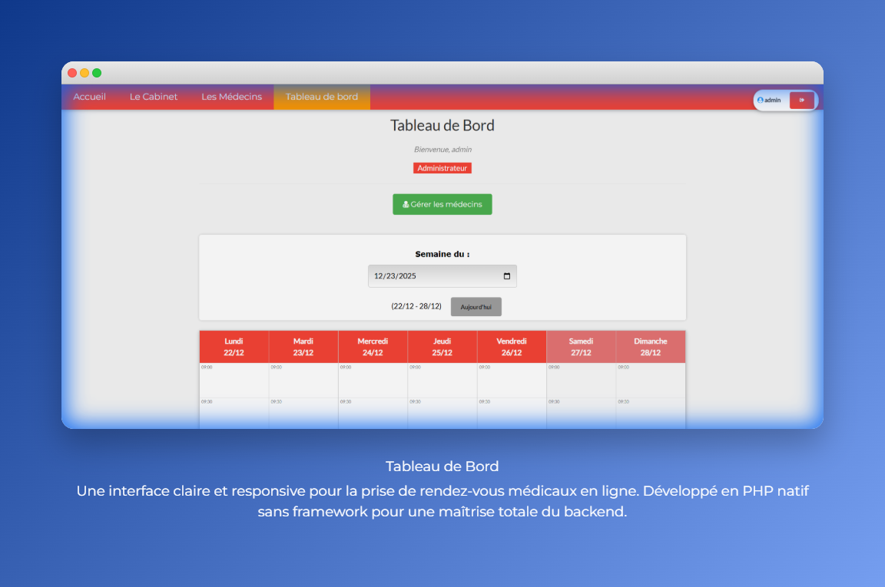
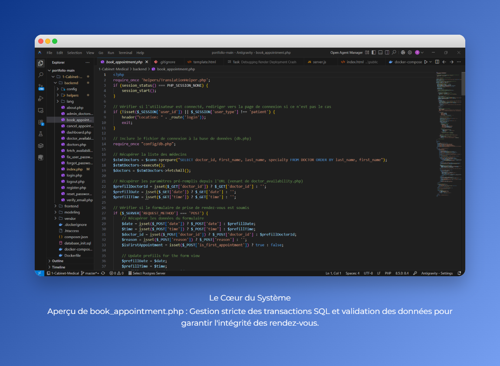
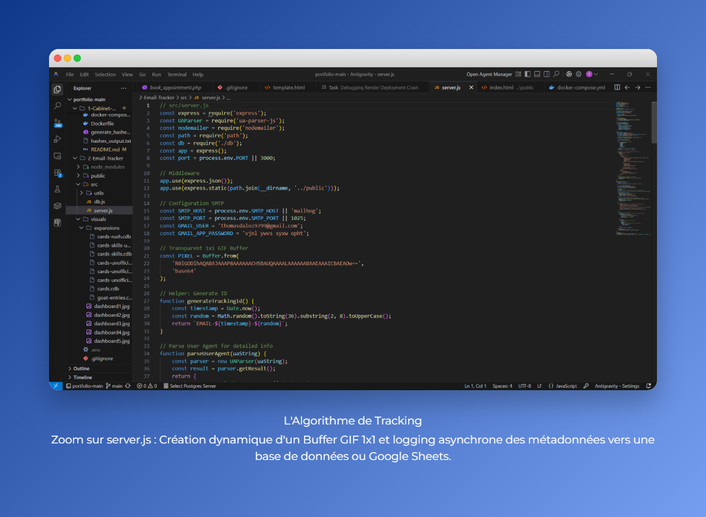
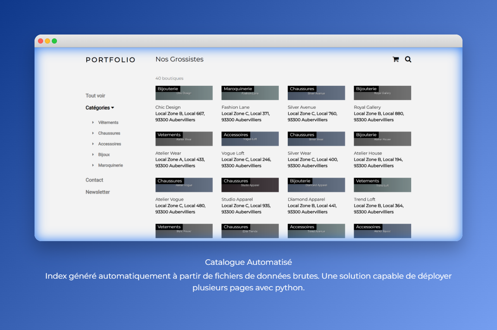
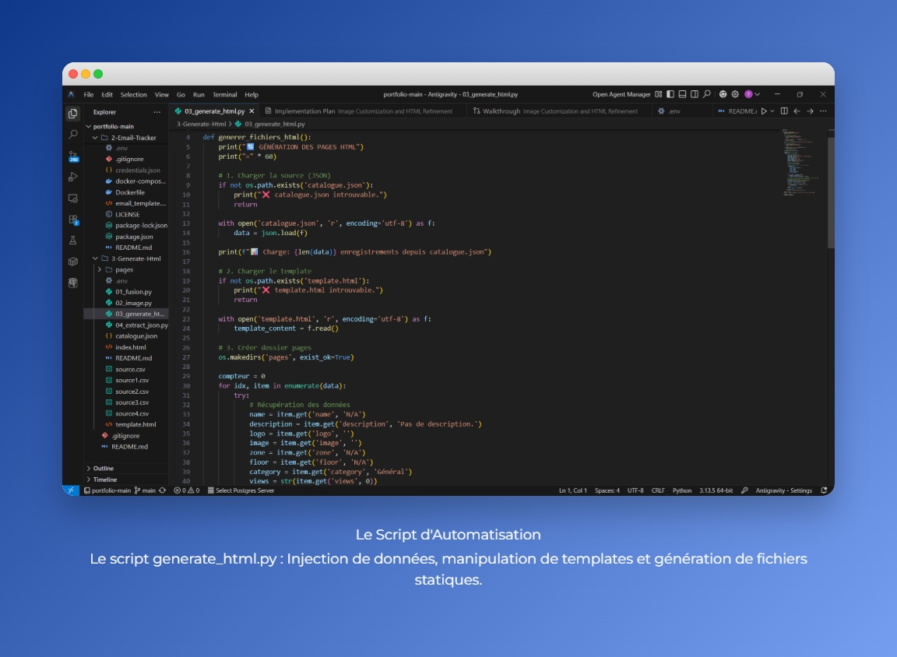

# 🚀 Portfolio Technique | TechSculptor

**Développeur Junior Back-End (PHP/PostgreSQL) et Front-End (ReactJS/JavaScript/HTML5/CSS3).**

Ce répertoire démontre ma capacité à concevoir, développer et déployer des solutions simples et évolutives.

## 🛠️ Compétences Techniques Clés

* **Backend & API :** PHP, Sécurité (PDO, Hachage), Docker, n8n (Workflows).
* **Frontend & UX :** ReactJS, JavaScript, HTML5/CSS3 (W3.CSS), Responsive.
* **Base de Données & BI :** PostgreSQL, Modélisation SQL, Looker Studio (pour la visualisation des données).
* **Déploiement :** Docker & Docker Compose, Variables d'environnement.

---

## 📂 Projets Clés

### 1️⃣ 1-Cabinet-Medical : Gestion de Cabinet Médical

Un système de gestion de rendez-vous complet simulant un environnement médical réel.
* **Objectif :** Une plateforme sécurisée pour patients, médecins et administrateurs.
* **Stack :** PHP, PostgreSQL, Docker, W3.CSS.
* **Points Forts :** Authentification sécurisée, rôles utilisateurs, planning dynamique.

**🚀 Comment tester ce projet :**
1. `cd 1-Cabinet-Medical`
2. `docker-compose up -d`
3. Accédez à `http://localhost:80`
4. Emails de test (inscriptions, réservations) sont visibles sur `http://localhost:8025` (MailHog).

[**📂 Voir le code du projet**](https://github.com/TechSculptor/portfolio/tree/main/1-Cabinet-Medical)

### 2️⃣ 2-Email-Tracker : Analytics & BI

Un service backend conçu pour suivre l'engagement utilisateur dans des campagnes d'emailing.
* **Objectif :** Collecter et visualiser les données d'engagement en temps réel.
* **Stack :** Node.js API, Docker, Google Sheets API.
* **Nouvelle Fonctionnalité :** Interface de démo pour envoyer des emails de test.
* **Demo Live :** [Voir les résultats Google Sheet](https://docs.google.com/spreadsheets/d/1nrTaYbgPlQ6pkQJciesmsbNWtLIxSX1mYTfJ8tflIUY/edit?usp=sharing)

**🚀 Comment tester ce projet (Local) :**
1. `cd 2-Email-Tracker`
2. `docker-compose up -d`
3. Accédez à `http://localhost:3000` pour l'interface de démo.
4. Envoyez un email et vérifiez sa réception sur `http://localhost:8026` (MailHog).

[**📂 Voir le code du projet**](https://github.com/TechSculptor/portfolio/tree/main/2-Email-Tracker)

### 3️⃣ 3-Generate-Html : Génération de Site Statique

Automatisation de la création de pages HTML pour un annuaire de grossistes.
* **Stack :** Python (Pandas), HTML/CSS, JSON.
* **Méthodologie :**
    - 🔄 Pipeline optimisé en 4 étapes (Fusion -> Images -> HTML -> JSON).
    - 🎨 Génération dynamique de 40 pages web avec design responsive.
    - ☁️ Gestion hybride des images (Cloudinary ou local).
    - 📊 Export des données structurées pour API.

[**📂 Voir le code du projet**](https://github.com/TechSculptor/portfolio/tree/main/3-Generate-Html) | [**✨ Voir le rendu final (40 pages)**](3-Generate-Html/index.html)

**🚀 Comment tester ce projet :**
1. `cd 3-Generate-Html`
2. `python -m http.server`
3. Accédez à `http://localhost:8000/index.html` pour voir le tableau de bord complet.

### 🔒 Note sur la Confidentialité

Le code source de ces projets a été entièrement anonymisé. Tous les noms d'entreprise, la logique métier propriétaire, et les identifiants de sécurité ont été retirés pour des raisons de confidentialité. Les projets présentés ici sont des versions génériques destinées à démontrer mes compétences techniques à des fins de recrutement.

---

## ⭐ Recommandation Professionnelle

> "Thomas a montré une **bonne motivation** et une réelle curiosité pour le métier de développeur informatique. Il s’est investi dans les missions confiées et a su **s’adapter progressivement à notre environnement de travail**. Son attitude a été **respectueuse, sérieuse** et il a manifesté un réel intérêt pour comprendre les outils, les méthodes et les enjeux liés au développement web et à l’organisation d’un projet technique. Cette immersion s’est déroulée dans de bonnes conditions et a été globalement positive."
>

> **— Quin Axel, Chef de projet, Easy Tech**

---

## 📸 Aperçu Visuel

Quelques captures des projets réalisés :

*Vue d'ensemble et accueil*

*Code des fonctionnalités médicales*

*Code de gestion et tracking*

*Génération automatique de catalogue*

*Back-office et administration*
