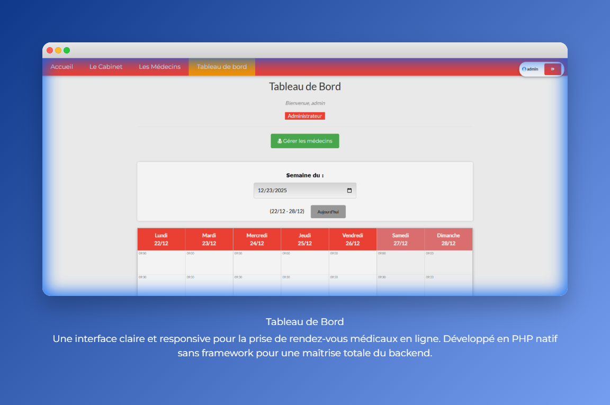
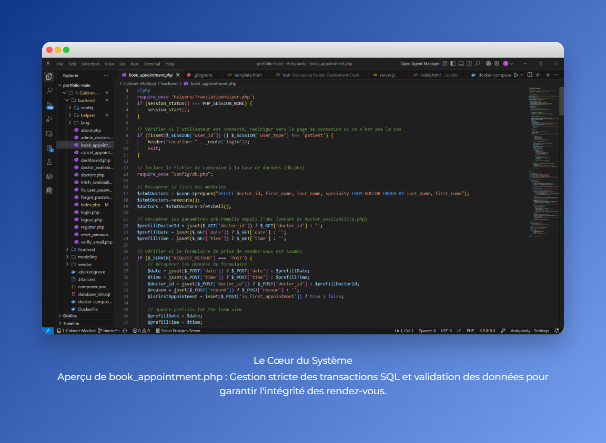
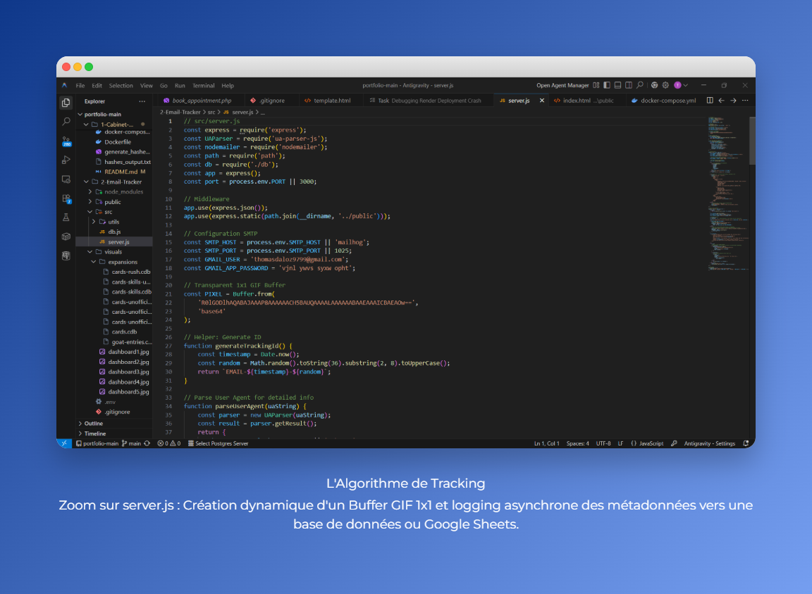
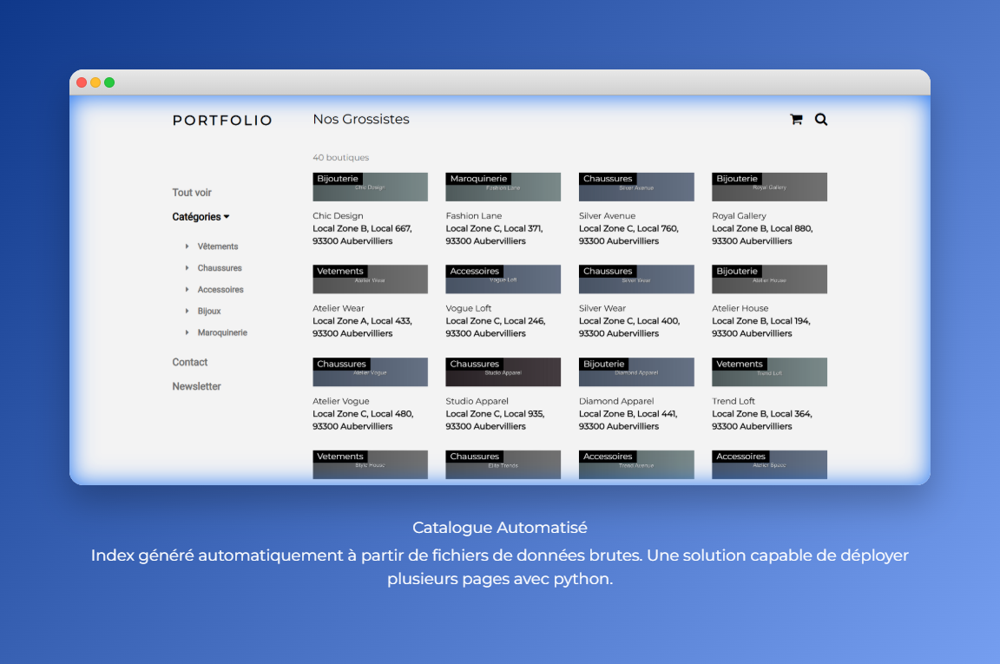
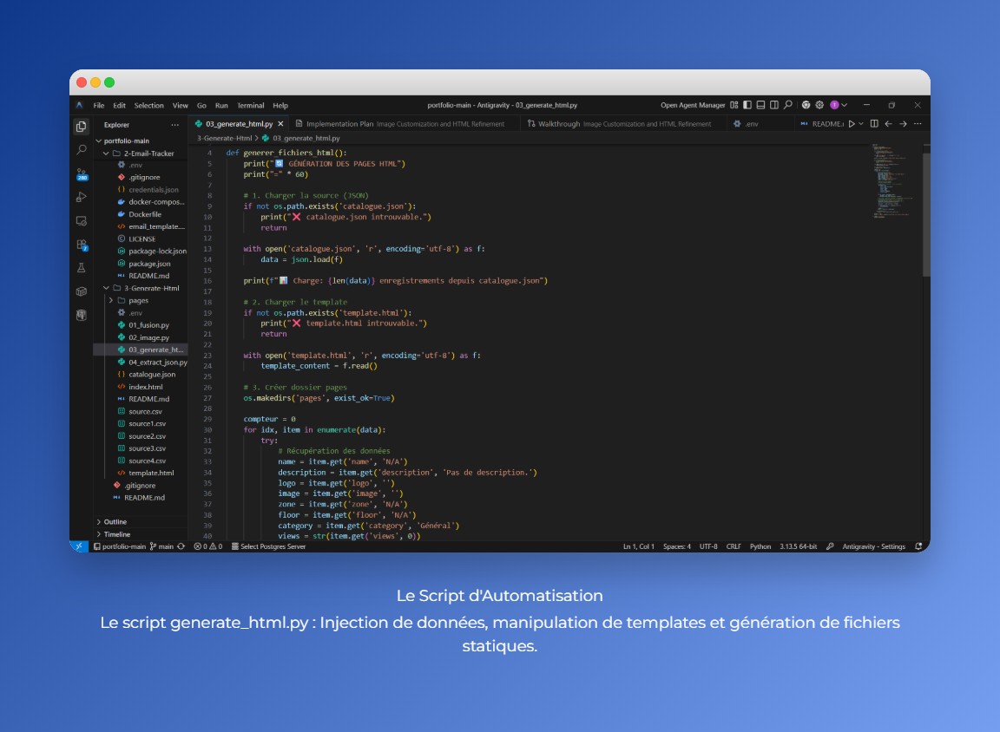
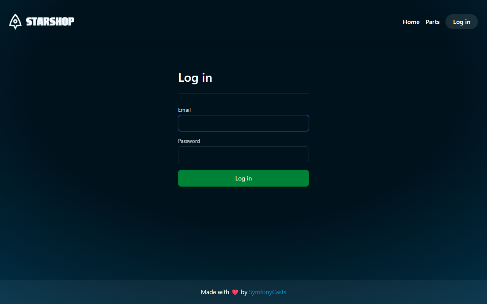
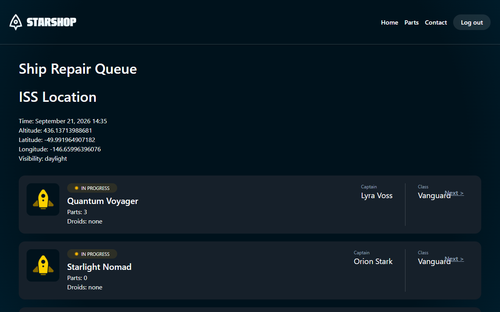
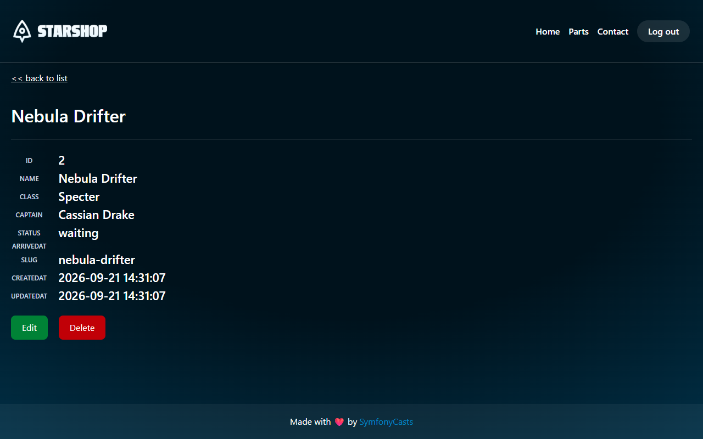
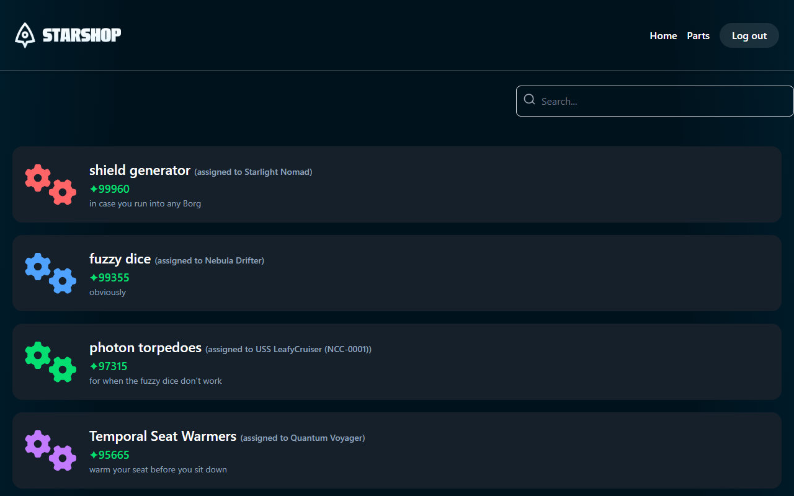
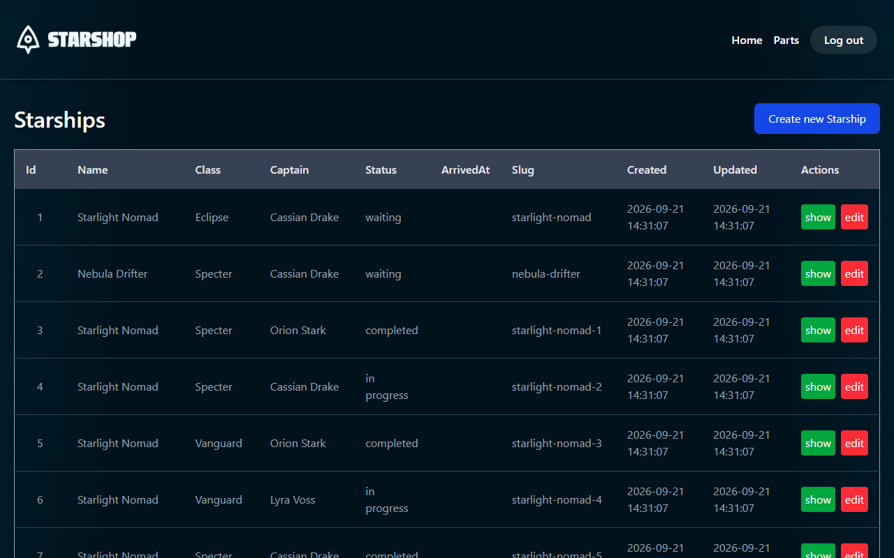

# 🚀 Portfolio Technique | TechSculptor

**Développeur Junior Back-End (PHP/PostgreSQL) et Front-End (ReactJS/JavaScript/HTML5/CSS3).**

Ce répertoire démontre ma capacité à concevoir, développer et déployer des solutions simples et évolutives.

## 🛠️ Compétences Techniques Clés

* **Backend & API :** PHP, Sécurité (PDO, Hachage), Docker, n8n (Workflows).
* **Frontend & UX :** Angular (Signals, Standalone Components), ReactJS, TypeScript, JavaScript, HTML5/CSS3 (W3.CSS), Responsive.
* **Base de Données & BI :** PostgreSQL, Modélisation SQL, Looker Studio (pour la visualisation des données).
* **Déploiement :** Docker & Docker Compose, Variables d'environnement.

---

## 📂 Projets Clés

### 1️⃣ 1-Cabinet-Medical : Gestion de Cabinet Médical

Un système de gestion de rendez-vous complet simulant un environnement médical réel.
* **Objectif :** Une plateforme sécurisée pour patients, médecins et administrateurs.
* **Stack :** PHP, PostgreSQL, Docker, W3.CSS.
* **Points Forts :** Authentification sécurisée, rôles utilisateurs, planning dynamique.

**🚀 Comment tester ce projet :**
1. `cd 1-Cabinet-Medical`
2. `docker-compose up -d`
3. Accédez à `http://localhost:80`
4. Emails de test (inscriptions, réservations) sont visibles sur `http://localhost:8025` (MailHog).

[**📂 Voir le code du projet**](https://github.com/TechSculptor/portfolio/tree/main/1-Cabinet-Medical)

### 2️⃣ 2-Email-Tracker : Analytics & BI

Un service backend conçu pour suivre l'engagement utilisateur dans des campagnes d'emailing.
* **Objectif :** Collecter et visualiser les données d'engagement en temps réel.
* **Stack :** Node.js API, Docker, Google Sheets API.
* **Nouvelle Fonctionnalité :** Interface de démo pour envoyer des emails de test.
* **Demo Live :** [Voir les résultats Google Sheet](https://docs.google.com/spreadsheets/d/1nrTaYbgPlQ6pkQJciesmsbNWtLIxSX1mYTfJ8tflIUY/edit?usp=sharing)

**🚀 Comment tester ce projet (Local) :**
1. `cd 2-Email-Tracker`
2. `docker-compose up -d`
3. Accédez à `http://localhost:3000` pour l'interface de démo.
4. Saisissez une adresse email : l'application est en **mode simulation** (aucun email n'est réellement envoyé) et affiche deux liens, « Simuler Ouverture » et « Simuler Clic », qui déclenchent le pixel de suivi.
5. Sans identifiants Google (`credentials.json` + `GOOGLE_SHEET_ID`), l'enregistrement dans Google Sheets est ignoré : voir le [guide de démonstration](#-lancer-les-5-projets-guide-de-démonstration).

[**📂 Voir le code du projet**](https://github.com/TechSculptor/portfolio/tree/main/2-Email-Tracker)


### 3️⃣ 3-Generate-Html : Génération de Site Statique

Automatisation de la création de pages HTML pour un annuaire de grossistes.
* **Stack :** Python (Pandas), HTML/CSS, JSON.
* **Méthodologie :**
    - 🔄 Pipeline optimisé en 4 étapes (Fusion -> Images -> HTML -> JSON).
    - 🎨 Génération dynamique de 40 pages web avec design responsive.
    - ☁️ Gestion hybride des images (Cloudinary ou local).
    - 📊 Export des données structurées pour API.

[**📂 Voir le code du projet**](https://github.com/TechSculptor/portfolio/tree/main/3-Generate-Html)

[**✨ Voir le rendu final (40 pages)**](https://techsculptor.github.io/portfolio/3-Generate-Html/index.html)

**🚀 Comment tester ce projet :**
1. `cd 3-Generate-Html`
2. `python -m http.server 8001`
3. Accédez à `http://localhost:8001/index.html` pour voir le tableau de bord complet (les pages sont déjà générées, aucune installation Python n'est nécessaire).

### 4️⃣ 4-Todo-List-Dev : Todo List Angular pour Développeurs

Une todo-list conçue spécifiquement pour l'organisation quotidienne d'un développeur, construite avec Angular 21 (Signals, composants standalone, nouvelle syntaxe de contrôle de flux).
* **Objectif :** Aller au-delà du CRUD basique pour explorer un vrai cas d'usage produit (priorités, catégorisation, suivi de sous-tâches, rappels adaptatifs).
* **Stack :** Angular 21, TypeScript, Signals (`signal`/`computed`/`effect`), `localStorage`.
* **Points Forts :**
    - 🏗️ Code organisé par responsabilité (types, utilitaires de dates, données/persistance, statistiques, composant) plutôt qu'un fichier unique.
    - 🔁 État 100% réactif via Signals, sans RxJS, avec immutabilité systématique des mises à jour.
    - 🔔 Rappels dont la fréquence s'adapte à la proximité de l'échéance.
    - 🤖 Suggestion de documentation façon agent IA (mockée côté client par design, pour ne jamais exposer de clé API dans le navigateur).
    - 💾 Persistance `localStorage` avec migration de schéma pour les anciennes données sauvegardées.

**🚀 Comment tester ce projet :**
1. `cd 4-Todo-List-Dev`
2. `npm install`
3. `npm start`
4. Accédez à `http://localhost:4200`

[**📂 Voir le code du projet**](https://github.com/TechSculptor/portfolio/tree/main/4-Todo-List-Dev)

[**✨ Voir la démo live**](https://techsculptor.github.io/portfolio/4-Todo-List-Dev/demo/index.html)

### 5️⃣ 5-Starshop : Boutique de vaisseaux Symfony

Une boutique / atelier de réparation de vaisseaux spatiaux fictif, construite avec Symfony 8.1 pour démontrer la conception d'une application web complète avec PHP et PostgreSQL.
* **Objectif :** Modéliser un catalogue relationnel (vaisseaux, pièces, droïdes) avec authentification, back-office d'administration et appel à une API externe.
* **Stack :** Symfony 8.1, PHP, Doctrine ORM (migrations), PostgreSQL, Twig, Stimulus/Turbo, Tailwind CSS, Docker Compose, PHPUnit.
* **Points Forts :**
    - 🏗️ Code organisé par responsabilité (entités, dépôts, contrôleurs, formulaires, commandes console, factories).
    - 🔐 Authentification `form_login` avec deux rôles (`ROLE_USER` en consultation, `ROLE_ADMIN` pour le CRUD) et protection CSRF.
    - 🗃️ Relations Doctrine complètes, pagination (Pagerfanta), slugs et horodatage automatiques (Gedmo).
    - 🌱 Jeux de données de démonstration générés avec Zenstruck Foundry, et commandes console dédiées (création d'utilisateur, check-in / retrait / rapport de vaisseaux).
    - 🌍 Intégration de l'API publique `wheretheiss.at` (position de l'ISS) via HttpClient et pools de cache.
    - 🧪 Tests PHPUnit sur base dédiée, avec client HTTP mocké pour ne jamais dépendre du réseau.

**🚀 Comment tester ce projet :**
1. `cd 5-Starshop`
2. `cp .env.example .env` (PowerShell : `Copy-Item .env.example .env`)
3. `composer install`
4. `docker compose up -d` (PostgreSQL, Mailpit, Mercure)
5. `php bin/console doctrine:migrations:migrate --no-interaction`
6. `php bin/console doctrine:fixtures:load --no-interaction`
7. `php bin/console app:user:create demo@example.com --admin --password=starshop-demo`
8. `php -d memory_limit=-1 bin/console tailwind:build`
9. `symfony serve` (ou `php -S 127.0.0.1:8000 -t public`)
10. Accédez à `http://127.0.0.1:8000` et connectez-vous avec `demo@example.com` / `starshop-demo`.

Voir le [README du projet](5-Starshop/README.md) pour le détail (tests, authentification, architecture).

[**📂 Voir le code du projet**](https://github.com/TechSculptor/portfolio/tree/main/5-Starshop)

### 🔒 Note sur la Confidentialité

Le code source de ces projets a été entièrement anonymisé. Tous les noms d'entreprise, la logique métier propriétaire, et les identifiants de sécurité ont été retirés pour des raisons de confidentialité. Les projets présentés ici sont des versions génériques destinées à démontrer mes compétences techniques à des fins de recrutement.

---

## 🎬 Lancer les 5 projets (guide de démonstration)

Ce guide permet de tout démarrer sur une machine Windows, macOS ou Linux, puis de tout arrêter proprement. Les commandes ont été testées sur Windows 11.

### 🌐 Sans rien installer

Deux projets sont consultables directement dans le navigateur (GitHub Pages) :

| Projet | Lien |
|---|---|
| 3-Generate-Html | [Annuaire de 40 pages](https://techsculptor.github.io/portfolio/3-Generate-Html/index.html) |
| 4-Todo-List-Dev | [Todo List Angular](https://techsculptor.github.io/portfolio/4-Todo-List-Dev/demo/index.html) |

Les projets 1, 2 et 5 ont un back-end (PHP, Node, Symfony) et une base de données : ils se lancent en local.

### 🧰 Prérequis

| Outil | Nécessaire pour | Version testée |
|---|---|---|
| [Git](https://git-scm.com/) | récupérer le code | — |
| [Docker Desktop](https://www.docker.com/products/docker-desktop/) (démarré) | projets 1, 2 et 5 | 29.x |
| [Node.js](https://nodejs.org/) 20.19 ou plus + npm | projet 4 | 24.13 |
| [Python 3](https://www.python.org/) | projet 3 | 3.13 |
| PHP 8.4+ et [Composer](https://getcomposer.org/) | projet 5 | 8.5 |
| [Symfony CLI](https://symfony.com/download) (facultatif) | projet 5 | — |

```bash
git clone https://github.com/TechSculptor/portfolio.git
cd portfolio
```

### 🔌 Ports utilisés (aucun conflit entre les projets)

| Projet | Ports |
|---|---|
| 1-Cabinet-Medical | `80` (site), `8025` (MailHog), `5432` (PostgreSQL), `1025` |
| 2-Email-Tracker | `3000` (site), `8026` (MailHog), `1026` |
| 3-Generate-Html | `8001` |
| 4-Todo-List-Dev | `4200` |
| 5-Starshop | `8000` (site), `55432` (PostgreSQL) |

Si le port `80` est déjà pris (autre serveur web local), arrêtez-le avant de lancer le projet 1.

### 1️⃣ 1-Cabinet-Medical

```bash
cd 1-Cabinet-Medical
docker compose up --build -d
```

Attendre environ 10 secondes (initialisation de la base), puis :

| Service | URL |
|---|---|
| Site | http://localhost |
| MailHog (emails de test) | http://localhost:8025 |

* **Compte administrateur :** identifiant `admin`, mot de passe `admin123`.
* **Compte patient :** *Inscription*, puis cliquer sur le lien de vérification reçu dans MailHog, puis *Connexion*.
* Parcours complet des 12 fonctionnalités : [README du projet](1-Cabinet-Medical/README.md).
* **Arrêt :** `docker compose down -v` (le `-v` efface aussi la base).

### 2️⃣ 2-Email-Tracker

```bash
cd 2-Email-Tracker
docker compose up --build -d
```

* Interface de démo : http://localhost:3000
* Saisir une adresse email : l'application fonctionne en **mode simulation**, aucun email n'est envoyé (rien n'arrive dans MailHog). Elle renvoie deux liens : **Simuler Ouverture** (le pixel invisible) et **Simuler Clic**.
* **Google Sheets :** l'enregistrement des ouvertures dans la feuille nécessite un compte de service Google (`credentials.json` à la racine du projet) et la variable `GOOGLE_SHEET_ID`. Sans eux, le serveur démarre quand même et affiche `GOOGLE_SHEET_ID is missing. Skipping log.` dans ses logs (`docker logs email-tracker-app`). Pour montrer le résultat réel, ouvrir directement la [feuille Google Sheets](https://docs.google.com/spreadsheets/d/1nrTaYbgPlQ6pkQJciesmsbNWtLIxSX1mYTfJ8tflIUY/edit?usp=sharing) et le [dashboard Looker Studio](https://lookerstudio.google.com/reporting/d4218795-26ec-4770-bd6d-1634ff8426f5).
* **Arrêt :** `docker compose down`. Docker peut créer un dossier vide `credentials.json` si le fichier n'existe pas : il est ignoré par git, on peut le supprimer.

### 3️⃣ 3-Generate-Html

Les 40 pages sont déjà générées : il suffit de les servir.

```bash
cd 3-Generate-Html
python -m http.server 8001
```

* Tableau de bord : http://localhost:8001/index.html
* **Arrêt :** `Ctrl+C`.
* *(Facultatif)* Pour regénérer les pages : `pip install pandas Pillow requests python-dotenv cloudinary`, puis `python 01_fusion.py`, `02_image.py`, `03_generate_html.py` et `04_extract_json.py` dans cet ordre (détail dans le [README du projet](3-Generate-Html/README.md)).

### 4️⃣ 4-Todo-List-Dev

```bash
cd 4-Todo-List-Dev
npm install
npm start
```

* Application : http://localhost:4200 (compter environ 25 secondes pour l'installation, puis 15 secondes de compilation).
* **Arrêt :** `Ctrl+C`.

### 5️⃣ 5-Starshop

```bash
cd 5-Starshop
cp .env.example .env            # PowerShell : Copy-Item .env.example .env
composer install
docker compose up -d            # PostgreSQL, Mailpit, Mercure
php bin/console doctrine:migrations:migrate --no-interaction
php bin/console doctrine:fixtures:load --no-interaction
php bin/console app:user:create demo@example.com --admin --password=starshop-demo
php -d memory_limit=-1 bin/console tailwind:build
symfony serve                   # laisser ce terminal ouvert (sans Symfony CLI : php -S 127.0.0.1:8000 -t public)
```

* Site : http://127.0.0.1:8000, connexion avec `demo@example.com` / `starshop-demo` (tout le site est protégé par un login).
* Pages à montrer : catalogue et position de l'ISS (`/`), pièces avec recherche (`/parts`), back-office (`/admin/starship`, réservé à l'administrateur).
* Le `php -d memory_limit=-1 …` n'est nécessaire qu'une fois : le premier `tailwind:build` télécharge un binaire de 130 Mo qui dépasse la limite mémoire par défaut de PHP.
* Tests : `php bin/console --env=test doctrine:database:create --if-not-exists`, puis `php bin/console --env=test doctrine:migrations:migrate --no-interaction`, puis `php bin/phpunit` (14 tests).
* Sous Windows, `symfony serve -d` (arrière-plan) peut échouer avec « The process cannot access the file because it is being used by another process » : lancer simplement `symfony serve` dans un terminal dédié, ou utiliser `php -S`.
* **Arrêt :** `Ctrl+C` dans le terminal du serveur, puis `docker compose stop`.

### 🎯 Ordre conseillé pour une présentation

1. **Avant l'entretien** : lancer les projets 1, 2 et 5 (les builds Docker et l'installation Composer prennent quelques minutes la première fois) et vérifier chaque URL.
2. Commencer par les démos en ligne (projets 3 et 4), qui ne dépendent d'aucune installation.
3. Enchaîner sur le projet 1 (le plus complet : rôles, emails, calendrier), puis le projet 5, puis le projet 2 avec la feuille Google Sheets.

### 🩺 En cas de problème

| Symptôme | Cause probable et solution |
|---|---|
| `docker : failed to connect to the docker API` | Docker Desktop n'est pas démarré : le lancer et attendre qu'il soit prêt. |
| `port is already allocated` / `address already in use` | Un autre programme utilise le port (voir le tableau des ports) : l'arrêter, ou `docker compose down` dans le projet concerné. |
| Projet 5 : page sans style | `tailwind:build` n'a pas été exécuté (voir l'étape correspondante). |
| Projet 5 : `Allowed memory size … exhausted` | Utiliser `php -d memory_limit=-1 bin/console tailwind:build`. |
| Projet 5 : erreur de connexion à la base | `docker compose up -d` n'est pas lancé, ou le mot de passe de `.env` ne correspond pas à `POSTGRES_PASSWORD`. |

---

## ⭐ Recommandation Professionnelle

> "Thomas a montré une **bonne motivation** et une réelle curiosité pour le métier de développeur informatique. Il s’est investi dans les missions confiées et a su **s’adapter progressivement à notre environnement de travail**. Son attitude a été **respectueuse, sérieuse** et il a manifesté un réel intérêt pour comprendre les outils, les méthodes et les enjeux liés au développement web et à l’organisation d’un projet technique. Cette immersion s’est déroulée dans de bonnes conditions et a été globalement positive."
>

> **— Quin Axel, Chef de projet, Easy Tech**

---

## 📸 Aperçu Visuel

Quelques captures des projets réalisés :


*Vue d'ensemble et accueil*


*Code des fonctionnalités médicales*


*Code de gestion et tracking*


*Génération automatique de catalogue*


*Back-office et administration*

### 5-Starshop (Symfony)


*Authentification `form_login` : tout le site est derrière un login*


*Catalogue paginé des vaisseaux et position de l'ISS (API externe)*


*Fiche détaillée d'un vaisseau*


*Catalogue de pièces avec recherche*


*Back-office CRUD réservé au rôle `ROLE_ADMIN`*
